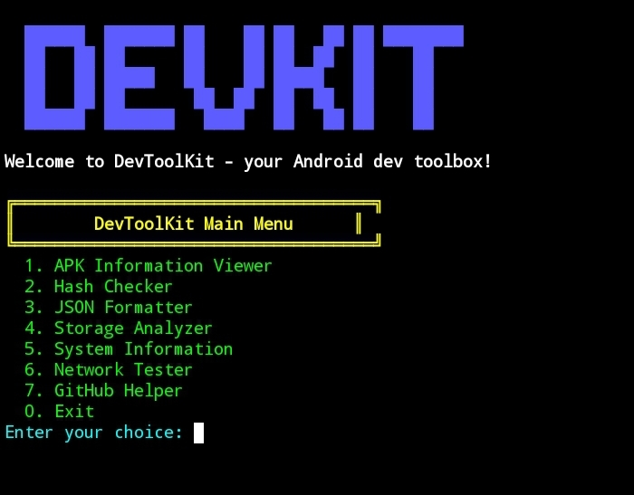
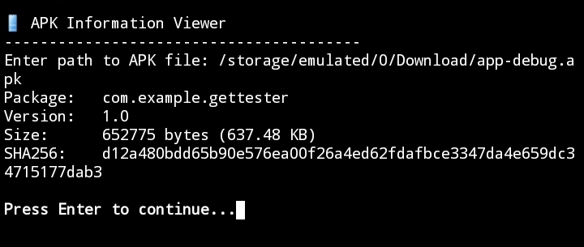
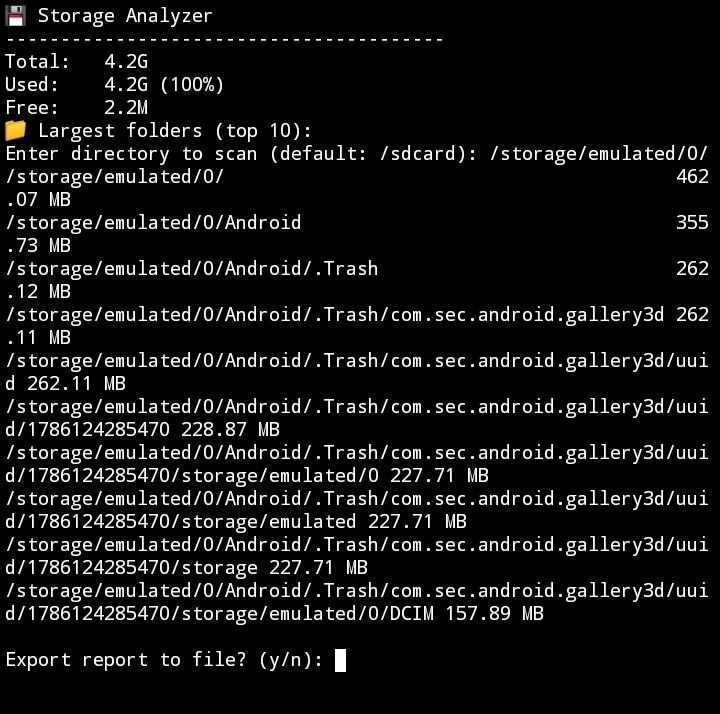
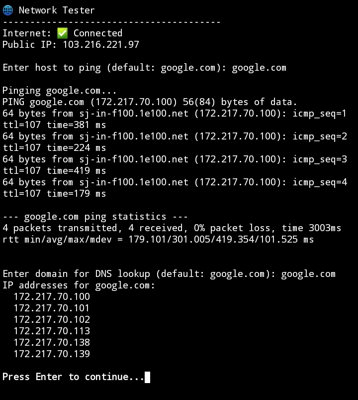

# 🛠️ DevToolKit – Android Developer Toolbox for Termux

[](https://python.org)
[](https://opensource.org/licenses/MIT)
[](https://github.com/yourusername/DevToolKit/releases)
[](https://termux.com)

DevToolKit is a collection of Python utilities for Android developers and Termux users. It's safe, beginner-friendly, and requires no root.

---

## 📸 Screenshots

Add your screenshots in a `screenshots/` folder and update the links below:

| Main Menu | APK Info | Storage Analyzer |
|-----------|----------|------------------|
|  |  |  |

| System Info | Network Tester |
|---------------|-------------|----------------|
[System](screenshots/system.png) |  |

---

## 📁 Project Structure

```

DevToolKit/
├── main.py
├── requirements.txt
├── README.md
├── LICENSE
├── tools/
│   ├── init.py
│   ├── apk_info.py
│   ├── hash_checker.py
│   ├── json_formatter.py
│   ├── storage_analyzer.py
│   ├── system_info.py
│   ├── network_test.py
│   └── github_helper.py
├── assets/
│   └── banner.txt
└── reports/          (generated)

```

---

## ✨ Features

- **APK Information Viewer** – package, version, size, SHA256 (requires `aapt`)
- **Hash Checker** – MD5, SHA1, SHA256, verify against known hash
- **JSON Formatter** – validate, pretty‑print, save
- **Storage Analyzer** – disk usage, top 10 folders, export report
- **System Information** – Android version, kernel, CPU, RAM, battery, storage
- **Network Tester** – internet, public IP, ping, DNS lookup
- **GitHub Helper** – generate README, LICENSE, .gitignore, project skeleton

---

## 📦 Installation

```bash
pkg update && pkg upgrade
pkg install python git aapt
git clone https://github.com/batplatbot/DevToolKit.git
cd DevToolKit
pip install -r requirements.txt
python main.py
```

Optionally run termux-setup-storage to access /sdcard.

---

🗺️ Roadmap (v1.0.0)

☑ All current features
☐ APK Permission Viewer
☐ Battery Diagnostics
☐ Project Templates
☐ Backup Utilities

---

📄 License

MIT – see LICENSE.

---

Built with ❤️ for the Termux community.

```

---
